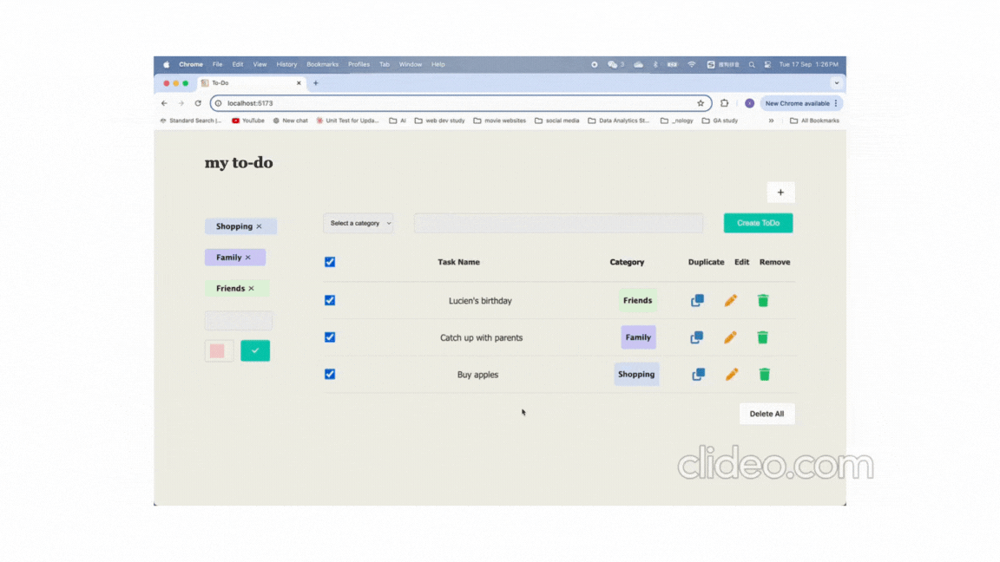

# Task Tracking System

The Task Tracking System is a full-stack application designed to help users efficiently manage their tasks through a user-friendly interface. This application allows for task creation, editing, duplication, and deletion within customized categories.

## Demo

- Here's a link to a live demo of the Task Tracking System:[Live Demo](???)
  

---

## Table of Contents

- [Purpose](#purpose)
- [Design Goals](#design-goals)
- [Technologies Used](#Technologies-used)
- [Features](#features)
- [Challenges](#challenges)
- [Known Issues](#known-issues)
- [Future Goals](#future-goals)

---

## Purpose

The purpose of this project includes:

- **Learning Goal**: To practice and demonstrate capabilities in React and the Java Spring framework as a full-stack solution.
- **Functional**: To offer users a dynamic way to manage tasks including add, edit, duplicate, and delete functionalities.
- **Unit Test**: Ensured methods and functions run successfully through unit testing.
- **CI/CD**: Used GitHub to automate test execution.
- **Adaptive**: Ensuring a responsive layout that works across various devices and screen sizes.

---

## Design Goals

- **Frontend**: Build a dynamic and interactive website using TypeScript that provides a seamless user experience.
- **Backend**: Use MySQL to store and manage all product data, Java and Spring Framework
- **Responsive**: Ensure the website is fully responsive and works well across various screen sizes.

## Technologies Used

- **Frontend**: React.js, TypeScript, SCSS
- **Backend**: Java, Spring
- **Database**: MySQL
- **Unit Test**:com.h2database, mockito
- **Others**: React-Hook-Form

## Features

- **CRUD Operations**: Users can create, read, update, and delete tasks.
- **Category Management**: Users can add and manage categories for tasks.
- **In-Place Editing**: Provides an interactive user experience by allowing in-place editing of tasks.
- **Responsive Design**: Fully responsive layout that adjusts to desktops, tablets, and mobile phones.

## 

## 

## Challenges

- **Edit Task in Place**: One of the most challenging parts was allowing users to edit their task content in place, rather than navigating to another page. So I implemented the updating data logic directly on the spot where the task item is displayed. So, when a user clicks the edit icon, it switches to an editable form in the same spot. This provided a more user-friendly experience.

---

## Known Issues

---

## Future Goals

1. **Sort By Category**: Implementation of task sorting by categories.
2. **Add Due Date**: Introduce due dates for tasks.
3. **Notifications**: Implement notifications for due tasks.
4. **Unit Testing**: CI/CD Add Unit Testing.

---

## Conclusion

The Task Tracking System project was a comprehensive exercise in applying full-stack development skills using React, TypeScript, and the Java Spring Framework. Through this project, I was able to enhance my understanding of these technologies, especially in how they interact to create a seamless user experience. The project also presented challenges such as managing state across components and ensuring responsiveness across devices, which pushed me to find efficient and scalable solutions.
